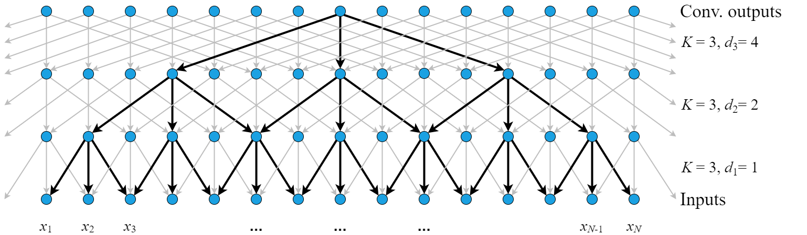
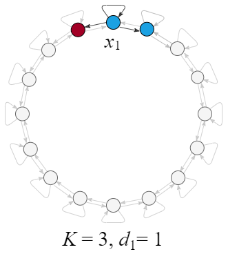
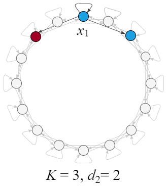
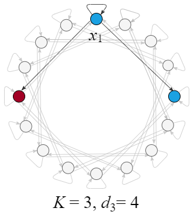
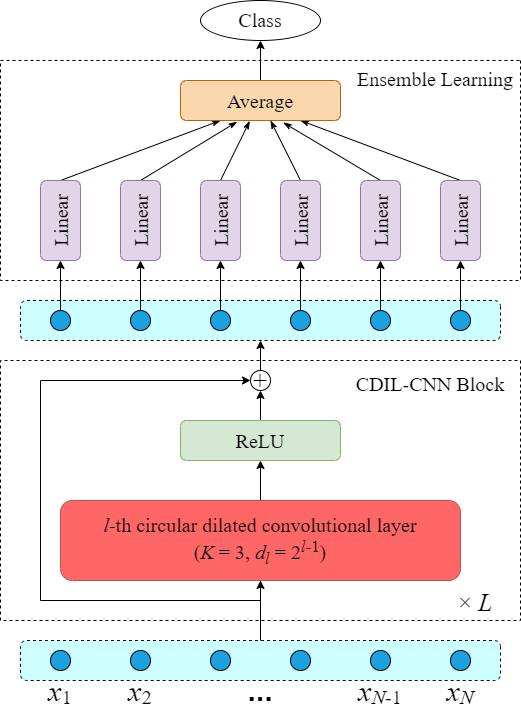

# Classification of Long Sequential Data using Circular Dilated Convolutional Neural Networks

paper: [https://doi.org/10.1016/j.neucom.2022.10.054](https://doi.org/10.1016/j.neucom.2022.10.054). 

## **Architecture**
CDIL-CNN is a novel convolutional model for sequence classification. We use symmetric dilated convolutions, a circular mixing protocol, and an average ensemble learning.

#### Symmetric Dilated Convolutions
<p align="left">

</p>


#### Circular Mixing
<p align="left">



</p>


#### CDIL-CNN
<p align="left">

</p>


## **Experiments**

### Synthetic Task
To reproduce the synthetic data experiment results, you should:
1. Run ***xor_generation.py***;
2. Run ***xor_main.py*** for one model or run ***xor_all.sh*** for all models.

The generator will create 3 files for each sequence length and store them in the **./xor_datasets/** folder in the following format:
`xor_{length}_train.pt`
`xor_{length}_test.pt`
`xor_{length}_val.pt`

The **./xor_log/** folder will save all results.
The **./xor_model/** folder will save all best models.


To reproduce the dissimilar experiment results, you should:
1. Run ***dissimilar_generation.py***;
2. Run ***dissimilar_main.py*** for one model or run ***dissimilar_all.sh*** for all models.

The generator will create 4 files for sequence length of 2048 and store them in the **./dissimilar_datasets/** folder in the following format:
`dissimilar_2048_train.pt`
`dissimilar_2048_test.pt`
`dissimilar_2048_val.pt`
`dissimilar_2048_dtest.pt`

The **./dissimilar_log/** folder will save all results.
The **./dissimilar_model/** folder will save all best models.

We provide our used configurations in ***syn_config.py***.


### Long Range Arena
Long Range Arena (LRA) is a public benchmark suite. The datasets and the download link can be found in [the official GitHub repository](https://github.com/google-research/long-range-arena). 

To reproduce the LRA experiment results, you should:
1. Download `lra_release.gz` (~7.7 GB), extract it, move the folder `./lra_release/lra_release` into our **./create_datasets/** folder, and run ***all_create_datasets.sh***. 
2. Run ***lra_main.py*** for one experiment or run ***lra_all.sh*** for all experiments.

The dataset creators will create 3 files for each task and store them in the **./lra_datasets/** folder in the following format:
`{task}.train.pickle`
`{task}.test.pickle`
`{task}.dev.pickle`

The **./lra_log/** folder will save all results.
The **./lra_model/** folder will save all best models.

We provide our used configurations in ***lra_config.py***.


### Time Series
The [UEA & UCR Repository](http://www.timeseriesclassification.com/) consists of various time series classification datasets. We use three audio datasets: [FruitFlies](http://www.timeseriesclassification.com/description.php?Dataset=FruitFlies), [RightWhaleCalls](http://www.timeseriesclassification.com/description.php?Dataset=RightWhaleCalls), and [MosquitoSound](http://www.timeseriesclassification.com/description.php?Dataset=MosquitoSound).

To reproduce the time series results, you should:
1. Download the datasets, extract them, move the extracted folders into our **./time_datasets/** folder, and run ***time_arff_generation.py***. 
2. Run ***time_main.py*** or  for one experiment or run ***time_all.sh*** for all experiments.

The generator will create 3 files for each dataset and store them in the **./time_datasets/** folder in the following format:
`{dataset}_train.csv`
`{dataset}_val.csv`
`{dataset}_test.csv`

The **./time_log/** folder will save all results.
The **./time_model/** folder will save all best models.

To reproduce the noisy RightWhaleCalls results, you should:
1. Run ***noise_generation.py***;
2. Run ***noise_main.py*** for one model or run ***noise_all.sh*** for all models.

The generator will create 8 files for each dataset and store them in the **./noise_datasets/** folder in the following format:
`RightWhaleCalls_train_data.csv`
`RightWhaleCalls_train_label.csv`
`RightWhaleCalls_val_data.csv`
`RightWhaleCalls_val_label.csv`
`RightWhaleCalls_test_data.csv`
`RightWhaleCalls_test_label.csv`
`RightWhaleCalls_dtest_data.csv`
`RightWhaleCalls_dtest_label.csv`

The **./noise_log/** folder will save all results.
The **./noise_model/** folder will save all best models.


We provide our used configurations in ***time_config.py***.

# **Cite**
```
@article{cheng2022classification,
  title={Classification of long sequential data using circular dilated convolutional neural networks},
  author={Cheng, Lei and Khalitov, Ruslan and Yu, Tong and Zhang, Jing and Yang, Zhirong},
  journal={Neurocomputing},
  year={2022},
  publisher={Elsevier}
}
```
